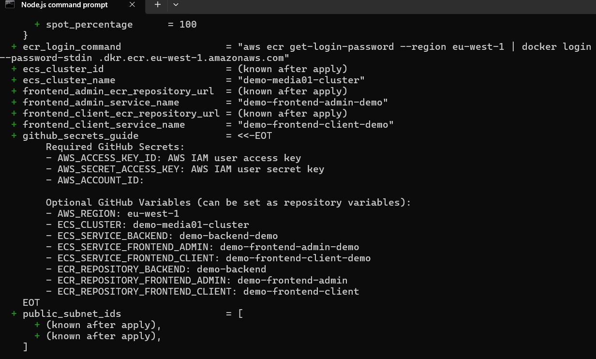
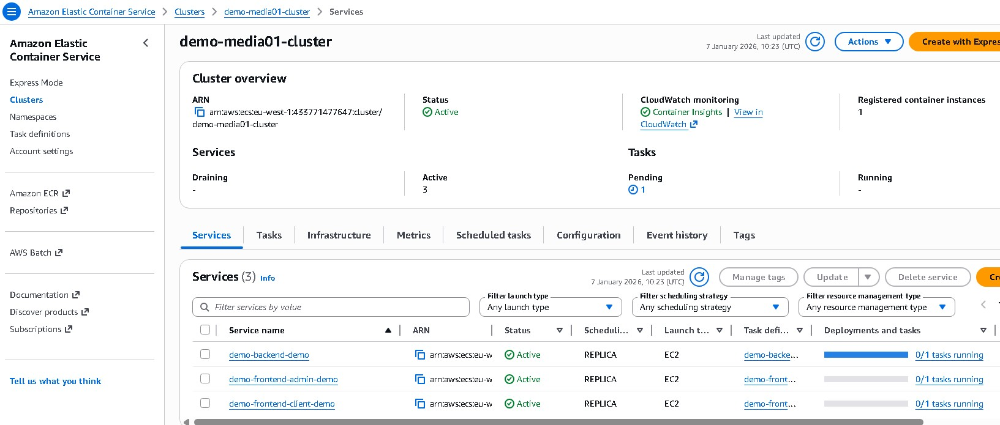

# Documentation

This directory contains project documentation, deployment guides, and reference materials.

## 📁 Directory Structure

```
docs/
├── README.md                    # This file
├── archive/                     # Historical documentation
├── recent/                      # Recent updates and changes
├── aws-CICD-progress-01.jpg     # CI/CD pipeline screenshot 1
├── aws-CICD-progress-02.jpg     # CI/CD pipeline screenshot 2
├── cap-Terraform-deploy-01.jpg # Terraform deployment screenshot 1
└── cap-Terraform-deploy-02.jpg # Terraform deployment screenshot 2
```

## 🚀 AWS Deployment Documentation

### Infrastructure Deployment

The project uses Terraform for Infrastructure as Code (IaC) to deploy to AWS.

**Terraform Deployment Screenshots:**


*Terraform deployment progress - Infrastructure provisioning*


*Terraform deployment completion - Resources created successfully*

### CI/CD Pipeline

Automated deployment using GitHub Actions with AWS ECS.

**CI/CD Pipeline Screenshots:**


*GitHub Actions CI/CD pipeline - Build and push stages*


*GitHub Actions CI/CD pipeline - Deployment stages*

## 📚 Documentation Sections

### Recent Updates (`recent/`)
- Latest architecture changes
- Deployment summaries
- Implementation guides
- Verification reports

### Archive (`archive/`)
- Historical documentation
- Previous implementation details
- Legacy guides and fixes

## 🔗 Related Documentation

- **Terraform Configuration**: See [../terraform/README.md](../terraform/README.md)
- **Demo Environment**: See [../terraform/demo/README.md](../terraform/demo/README.md)
- **Production Environment**: See [../terraform/production/README.md](../terraform/production/README.md)
- **Main Project README**: See [../README.md](../README.md)

## 📝 Contributing

When adding new documentation:
1. Place recent updates in `recent/`
2. Archive old documentation in `archive/`
3. Update this README if adding new sections
4. Include screenshots when documenting deployments
